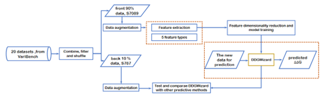

.. _introduction:

Introduction
=============

.. raw:: html

   

   Thermostability is an important property of proteins and increasing protein thermostability holds significant meaning in expanding the application scope of proteins. Until now, rational/semi-rational design combined with computational methods have become the widely used strategies to increase protein thermostability. Among combined computational methods, the ΔΔG prediction based on machine learning is popular[1], however, optimizing their insufficient accuracy remains a challenge[2]. To achieve accurate ΔΔG prediction, DDGWizard has been developed. DDGWizard introduced a comprehensive feature set related to protein thermostability changes, including 1547 features from 5 types; DDGWizard incorporates a workflow to extract features from raw ΔΔG data, supporting data process in a large scale; DDGWizard carried out feature dimensionality reduction to find best feature combination; DDGWizard includes a machine learning model to predict ΔΔG, trained with best feature combination and newly integrated dataset. After model evaluation of DDGWizard and comparison with other representative ΔΔG predictive methods, DDGWizard acheived 0.79 Pearson correlation coefficient in cross-validation and 0.68 Pearson correlation coefficient on test set, outperforming other 7 ΔΔG predictive methods: ACDC-NN[3], DDGun3D[4], FoldX[5], DynaMut[6], DUET[7], mCSM[8], and SDM[9]. The application program and source code have been published here, potentially prompting DDGWizard to become a useful resource for aiding rational design of protein thermostability.
   

.. raw:: html

   

